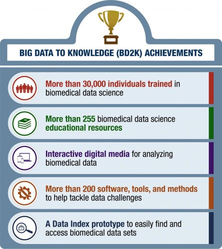
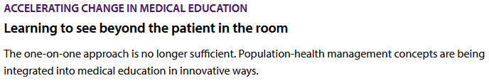
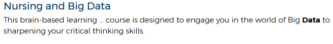

```{r setup, include=FALSE}
options(htmltools.dir.version = FALSE)
knitr::opts_chunk$set(
  fig.width=9, fig.height=3.5, fig.retina=3,
  out.width = "100%",
  cache = FALSE,
  echo = TRUE,
  message = FALSE, 
  warning = FALSE,
  fig.show = TRUE,
  hiline = TRUE
)

```

```{r xaringan-themer, include=FALSE, warning=FALSE}
library(xaringanthemer)
style_duo_accent(
  primary_color = "#8B1F41",
  secondary_color = "#C64600",
  inverse_header_color = "#FFFFFF",
  link_color = "#2CD5C4"
)
```

## Hello!

.pull-left[
.center[

]

]
.pull-right[
- PhD **Candidate**: Virginia Tech (Winter 2021)
  - Data Science education & pedagogy
  - Medical, Biomedical, Health Sciences
-  Inten at RStudio, 2019
  - [`gradethis`](https://github.com/rstudio-education/gradethis)
  - Code grader for [`learnr`](https://github.com/rstudio/learnr) documents
- The Carpentries
  - Instructor, 2014
  - Trainer, 2020
  - Community Maintainer Lead, 2020
- [R + Python!](https://rstudio.github.io/reticulate/)
- Author:
<center>
    
    
</center>
]

---

class: inverse center middle

# Current Data Science Education

---

.pull-left[

]

.pull-right[
- Data Science education is a **commodity**
  - Content is **not** an issue
  - Various learning platforms

- **Domain experts** can help learners improve **data literacy**


- Need more dedicated courses:
  - **Data Products**
  - **Data Cleaning**
  - **Reproducible Science**

.myfootnote[Kross, S., Peng, R. D., Caffo, B. S., Gooding, I., and Leek, J. T. (2020). The Democratization of Data Science Education. The American Statistician, 74(1), 1–7. https://doi.org/10.1080/00031305.2019.1668849]
]

---

.pull-left[


- Joint departments
]

.pull-right[


- Probability + Statistics
- Data Mining
- Programming
]

.myfootnote[Song, I.-Y., and Zhu, Y. (2016). Big data and data science: What should we teach? Expert Systems, 33(4), 364–373. https://doi.org/10.1111/exsy.12130]

---

# Data Science Programs Are Too General

- Data science programs target **single broad audiences**
- Opportunity to **branch out** to different disciplines
- Democratization of data science education enables more **domain specific** learning materials

.myfootnote[Kross, S., Peng, R. D., Caffo, B. S., Gooding, I., and Leek, J. T. (2020). The Democratization of Data Science Education. The American Statistician, 74(1), 1–7. https://doi.org/10.1080/00031305.2019.1668849]

---

# Why Domain Specificity?

- You learn better when things are more relevant

- Internal factors for motivation
- Learning feedback loops
- Self-directed learners


.myfootnote[
- Ambrose, S. A., Bridges, M. W., DiPietro, M., Lovett, M. C., and Norman, M. K. (2010). How learning works: Seven research-based principles for smart teaching. John Wiley & Sons.
- Koch, C., and Wilson, G. (2016). Software carpentry: Instructor Training. https://doi.org/10.5281/zenodo.57571
- Wilson, G. (2019). Teaching tech together: How to make your lessons work and build a teaching community around them. CRC Press.
]

---

# NIH Strategic Plan for Data Science


.myfootnote[
National Institutes of Health. (2020, September 14). NIH Strategic Plan for Data Science | Data Science at NIH. https://datascience.nih.gov/nih-strategic-plan-data-science
]

---

# NIH Biomedical Research

- Support substantial quantities of biomedical data and metadata
- Data is highly distributed
- Accomplished by small groups of researchers
- Variety of formats lead to complications in cleaning

- **Develop a research workforce**

---

# NIH The Big Data to Knowledge (BD2K)

.pull-left[

- 2013 - 2018
- Narrow the gap in biomedical data science skills
- Train and educate workforce on analytical skills

]
.pull-right[

]

---


Older terms: Knowledge, Comprehension, Application, Analysis, Synthesis, Evaluation

<!--
.myfootnote[
Anderson, L. W., Bloom, B. S., and others. (2001). A taxonomy for learning, teaching, and assessing: A revision of Bloom’s taxonomy of educational objectives. Longman,.
]
-->

---

# Computing + Statistics Curriculum Guidelines

.pull-left[
#### Computing Education

- 2005: Knowledge-based
- 2020: Competency-based
  - Discrepancy between graduates and work ability

```
competency = knowledge + skill + disposition
           = what + how + why
```

]
.pull-right[
#### Statistics Education

1. Teach statistical thinking
2. Focus on conceptual understanding.
3. Integrate real data with a context and a purpose.
4. Foster active learning.
5. Use technology to explore concepts and analyze data.
6. Use assessments to improve and evaluate student learning.
]

.myfootnote[
- Shackelford R, McGettrick A, Sloan R, et al. Computing Curricula 2005: The Overview Report. In: Proceedings of the 37th SIGCSE Technical Symposium on Computer Science Education. SIGCSE ’06. Association for Computing Machinery; 2006:456-457. doi:10.1145/1121341.1121482
- CC2020 Task Force. Computing Curricula 2020: Paradigms for Global Computing Education. ACM; 2020. doi:10.1145/3467967
- GAISE College Report ASA Revision Committee. Guidelines for Assessment and Instruction in Statistics Education (GAISE) College Report 2016.
]

---
# American Medical Association

.pull-left[
.center[


]
]
.pull-right[
.center[



]
]

.myfootnote[
American Medical Association. (2021). Accelerating Change in Medical Education. American Medical Association. https://www.ama-assn.org/education/accelerating-change-medical-education
]

---
# Applies to All Clinicians

.pull-left[
### American Nursing Association
.center[



]
]
.pull-right[
### Overcome Education Challenges

- Elective courses in informatics
- Professional society incentives
- Online or in-person forums to bring interest parties together
- Informal partnerships between medical students and informatics experts
]

.myfootnote[
- ANA Enterprise | American Nurses Association. ANA. Accessed September 29, 2021. https://www.nursingworld.org/
- Student interest in informatics outpaces opportunities: Study. American Medical Association. Accessed September 29, 2021. https://www.ama-assn.org/education/accelerating-change-medical-education/student-interest-informatics-outpaces-opportunities

]

---

# Interest in Informatics Outpace Opportunities

.center[

]

- Students who are interest in a clinical informatics related career
- Not aware of training opportunities

- Need to increase **quantity**, **quality**, and **publicity**

.myfootnote[
- American Medical Association. (2021). Accelerating Change in Medical Education. American Medical Association. https://www.ama-assn.org/education/accelerating-change-medical-education
- Banerjee R, George P, Priebe C, Alper E. Medical student awareness of and interest in clinical informatics. Journal of the American Medical Informatics Association. 2015;22(e1):e42-e47. doi:10.1093/jamia/ocu046
]


---

class: inverse center middle

# Identifying Our Learners

---

## What Do Our Learners Know?


.pull-left[
Concept Maps


Can also use "task deconstruction"
]

.pull-right[
Dreyfus model of skill acquisition


Novice, Competent, Proficient, Expert, Master
]

.myfootnote[
- Dreyfus, S. E., and Dreyfus, H. L. (1980). A five-stage model of the mental activities involved in directed skill acquisition. California Univ Berkeley Operations Research Center.
- Koch, C., and Wilson, G. (2016). Software carpentry: Instructor Training. https://doi.org/10.5281/zenodo.57571
- Wilson, G. (2019). Teaching tech together: How to make your lessons work and build a teaching community around them. CRC Press.
]

---

## Identify Learners: Learner Self-Assessment Survey

- VT IRB-20-537
- Surveys: https://github.com/chendaniely/dissertation-irb/tree/master/irb-20-537-data_science_workshops
  - Currently working on survey validation

- Combination of:
  - **The Carpentries** surveys: https://carpentries.org/assessment/
  - **"How Learning Works: Seven Research-Based Principles for Smart Teaching"** by Susan A. Ambrose, Michael W. Bridges, Michele DiPietro, Marsha C. Lovett, Marie K. Norman
  - **"Teaching Tech Together"** by Greg Wilson

1. Demographics (6)
2. Programs Used in the Past (1)
3. **Programming Experience** (6)
4. **Data Cleaning and Processing Experience** (4)
5. **Project and Data Management** (2)
6. **Statistics** (4)
7. Workshop Framing and Motivation (3)
8. Summary Likert (7)

---

## Occupations

- Grouped occupation demographic data into one of 3 groups.

<center>

</center>

---

## The Personas

Clare Clinician, Samir Student, Patricia Programmer, Alex Academic <br />
https://ds4biomed.tech/who-is-this-book-for.html#the-personas


---

<center>

</center>

---

class: inverse center middle

# Plan the Learning Materials

---

## Survey Responses: Excel

.pull-left[

]
.pull-right[

]

---

## Survey Responses: Data Literacy

.pull-left[

]
.pull-right[

]

---

## Planning the Learning Materials

Learning objectives:

1. **Name** the features of a tidy/clean dataset
2. **Transform** data for analysis
3. **Identify** when spreadsheets are useful
4. **Assess** when a task should not be done in a spreadsheet software
5. **Break down** data processing into smaller individual (and more manageable) steps
6. **Construct** a plot and table for exploratory data analysis
7. **Build** a data processing pipeline that can be used in multiple programs
8. **Calculate, interpret, and communicate** an appropriate statistical analysis of the data

---

class: inverse center middle

# Tidy Data

---

## Data is messy in different ways

<center>

</center>

.myfootnote[
- Allison Horst's Illustrations: https://github.com/allisonhorst/stats-illustrations
]

---

<center>

</center>

.myfootnote[Wickham, H. (2014). Tidy Data. Journal of Statistical Software, 59(1), 1–23. https://doi.org/10.18637/jss.v059.i10
]

---

<center>

</center>

.myfootnote[Wickham, H. (2014). Tidy Data. Journal of Statistical Software, 59(1), 1–23. https://doi.org/10.18637/jss.v059.i10
]

---

## A different view of data

.center[

]

.myfootnote[https://www.garrickadenbuie.com/project/tidyexplain/]

---

class: inverse center middle

# Learning and Teaching Materials

---

# ds4biomed Part 1 (6 Hours)

.pull-left[
.center[

]
]
.pull-right[
https://ds4biomed.tech/

1. Introduction
2. Spreadsheets
3. R + RStudio / Python + JupyterLab
4. Load Data
5. Descriptive Calculations

<hr>
6. Clean Data (Tidy)
7. Visualization (Intro)
8. Analysis Intro (Logistic Regression)
]
---

# ds4biomed Part 2 (6 Hours)

.pull-left[
.center[

]
]
.pull-right[
https://ds4biomed.tech/

9. 30-Day re-admittance
10. Working with multiple datasets
  - Joins
  - Databases

<hr>
11. APIs + Census data
12. Functions
13. Survival Analysis
14. Machine Learning Basics
]
---

# Example: Load a dataset

.pull-left[
### Python
```{python, eval=FALSE}
# load a library
# library alias
import pandas as pd

# use a library function
# know about paths
# variable assignment
# function arguments
dat = pd.read_excel("./data/cmv.xlsx")
```
]
.pull-right[
### R
```{r, eval=FALSE}
# load library
library(tidyverse)
library(readxl)

# use a library function
# know about paths
# variable assignment
# function arguments
dat <- read_excel("./data/cmv.xlsx")
```
]

---

# How does this help my practice?

- You can explore your own patient data
- Can work on curating your own data
- Potentially faster research-question cycle

---

class: inverse center middle

# Existing Materials

---
## Existing Data Science Book TOC: R + JS + Stats

.row[
.column[
__R for Data Science__
1. Welcome Introduction
1. Explore Introduction
1. Data visualisation
1. Workflow: basics
1. Data transformation
1. Workflow: scripts
1. Exploratory Data Analysis
1. Workflow: projects
1. Wrangle Introduction
1. Tibbles
1. Data import
1. **Tidy data**

...

Ch 21. iteration
]

.column[
__Data Science for JavaScript__
1. Introduction
1. Basic Features
1. Callbacks
1. Objects and Classes
1. HTML and CSS
1. Manipulating Pages
1. Dynamic Pages
1. Visualizing Data
1. Promises
1. Interactive Sites
1. **Managing Data**
1. Creating a Server
1. Testing
1. **Using Data-Forge**
1. Capstone Project
]

.column[
__OpenIntro Statistics__
1. **Introduction to Data**
2. Summarizing data
3. Probability
4. Distributions of random variables
5. Foundations of inference
6. Inference for categorical data
7. Inference for numerical data
8. Introduction to linear regression
9. Multiple and logistic regression
]
]

---

## Existing Data Science Book TOC: Python

.pull-left[
__Python for Data Analysis__
1. Preliminaries
1. Introductory Examples
1. IPython: An Interactive Computing and Development Environment
1. NumPy Basics: Arrays and Vectorized Computation
1. Getting Started with pandas
1. Data Loading, Storage, and File Formats
1. **Data Wrangling: Clean, Transform, Merge, Reshape**
8. Plotting and Visualization
9. Data Aggregation and Group Operations
10. Time Series
11. Financial and Economic Data Applications
12. Advanced NumPy

Appendix: Python Language Essentials
]

.pull-right[
__Learning the Pandas Library__
1. Introduction
1. Installation
1. Data Structures
1. Series
1. Series CRUD
1. Series Indexing
1. Series Methods
1. Series Plotting
1. Another Series Example
1. DataFrames
1. Data Frame Example
1. Data Frame Methods
1. Data Frame Statistics
1. **Grouping, Pivoting, and Reshaping**
1. Dealing With Missing Data
1. Joining Data Frames
1. Avalanche Analysis and Plotting
1. Summary
]

---

## Existing Data Science Book TOC: My Own Work

.row[
.column[
__Pandas for Everyone__
1. Pandas DataFrame Basics
1. Pandas Data Structures
1. Introduction to Plotting
1. Data Assembly
1. Missing Data
1. **Tidy Data**
7. Data Types
8. Strings and Text Data
9. Apply
10. Groupby Operations: Split–Apply–Combine
11. The datetime Data Type
12. Linear Models
13. Generalized Linear Models
14. Model Diagnostics
15. Regularization
16. Clustering
17. Life Outside of Pandas
18. Toward a Self-Directed Learner

Appendix: Python Language Essentials
]
.column[
__ds4biomed__
1. Introduction
1. Spreadsheets
1. R + RStudio
1. Load Data
1. Descriptive Calculations
1. **Clean Data (Tidy)**
7. Visualization (Intro)
8. Analysis (Intro)
9. Additional Resources
]
.column[
__Conference Workshop__
1. Introduction
2. **Tidy Data**
3. Functions
4. Plotting/Modeling
]
]

---

## Create Your Own Learner Personas

If you do end up teaching a domain specific group (e.g., biomedical sciences)

1. Identify who your learners are
2. Figure out what they need and want to know
3. Plan a guided learning tract

- Use the surveys I've compiled.

https://github.com/chendaniely/dissertation-irb/tree/master/irb-20-537-data_science_workshops

### What's Next?

- Survey Validation (Factor Analysis)
- Learner pre/post workshop "confidence"
- Long-term survey for confidence + retention (summative assessment)
- Different types of formative assessment questions

---

class: center, middle

# Thanks!

Slides: 

Repo: https://github.com/chendaniely/2021-09-30-changemeded-ds4biomed

Prelims: https://chendaniely.github.io/dissertation-prelim
